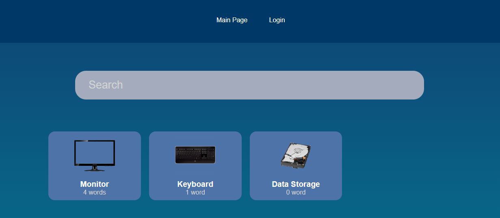
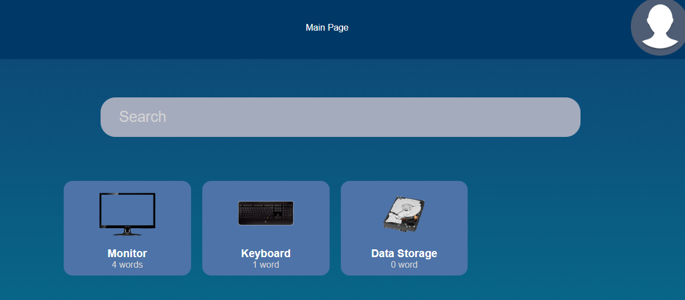
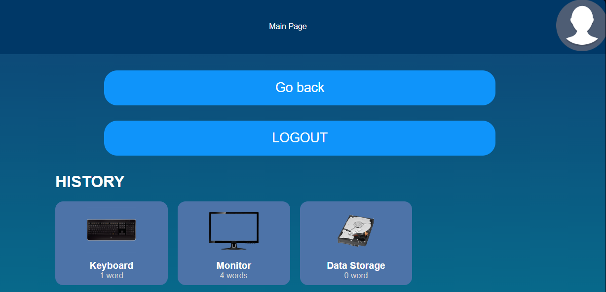
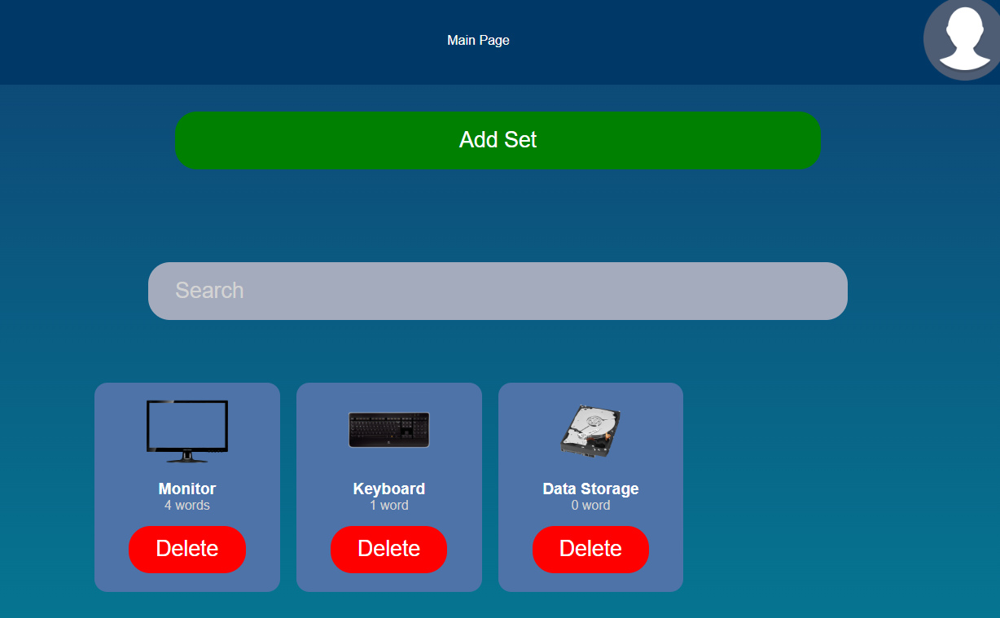
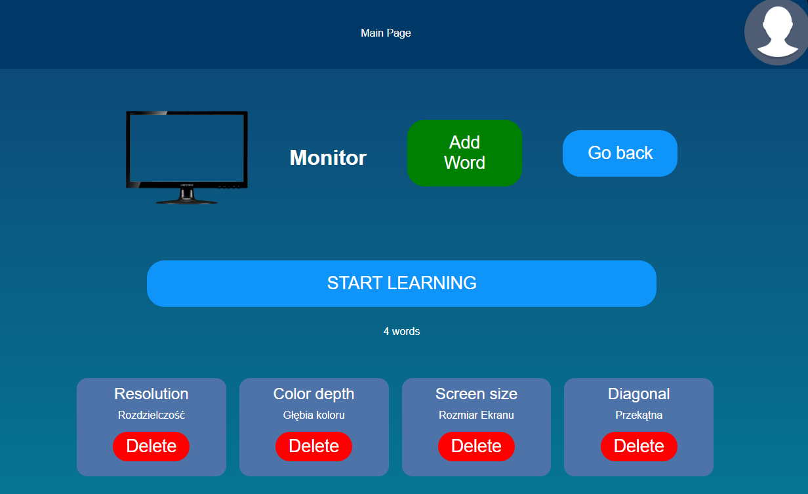

# Fiszlet

Web application made for classes "Wstęp Do Projektowania Aplikacji Internetowych" on the Cracow University of Technology.

Application is a collection of sets of flashcards, containing English-Polish translation of words about various subjects.

Unlogged Users can only browse the sets of flashcards.
Logged in Users also have the access to their history.
Users with Admin privilages can create their own sets of flashcards.


## Table of contents
- Application
- Requirements
- Installation
- Maintainers


## Application
#### Unlogged


#### Logged in


#### History


#### Admin


#### Set view of Admin



## Requirements

This app requires following frameworks and modules:
- [Docker container](https://www.docker.com)


## Installation
Deploy and run application inside the docker container using this command:
 `docker-compose -f docker-compose.yml up --build`

Then you need to configure a file "config.php":

```
<?php

class Config {
    public static $dbHost = '';
    public static $dbUser = '';
    public static $dbPass = '';
    public static $dbName = '';
    public static $dbPort = ;
}

?>
```


## Maintainers

- Filip Mysior - [github](https://www.github.com/Fifif17)